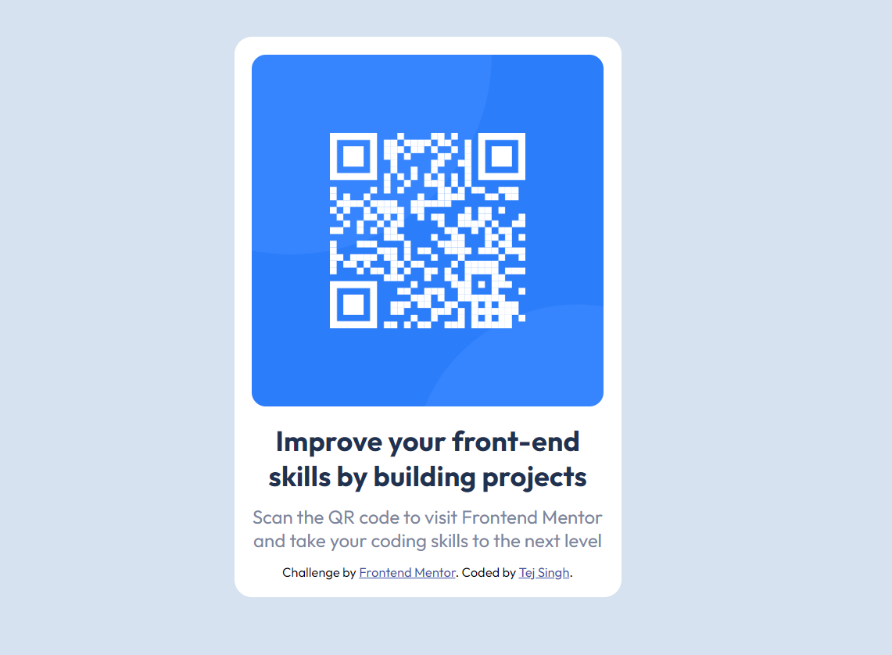

# Frontend Mentor - QR code component solution

This is a solution to the [QR code component challenge on Frontend Mentor](https://www.frontendmentor.io/challenges/qr-code-component-iux_sIO_H). Frontend Mentor challenges help you improve your coding skills by building realistic projects. 

## Table of contents

- [Overview](#overview)
  - [Screenshot](#screenshot)
  - [Links](#links)
- [My process](#my-process)
  - [Built with](#built-with)
  - [What I learned](#what-i-learned)
- [Author](#author)

## Overview

### Screenshot

### Links

- Solution URL: [Click Here](https://github.com/tejsingh442/qr-container)
- Live Site URL: [Click Here](https://tejsingh442.github.io/qr-container/)

## My process

### Built with

- Semantic HTML5 markup
- CSS custom properties

### What I learned

While working on this, I was having problem with centering the container. I learned techniques to center the container. I learned that min-height helps us with the alignment.

